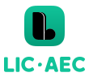

	

		
	

Procedimientos LIC·AEC
=============

Este listado de procedimientos (basado en [CIE-9](https://eciemaps.mscbs.gob.es/ecieMaps/browser/index_9_mc.html)) para el Libro Informático del Cirujano.

## Visualizar el listado de procedimientos
Puedes visualizar, buscar, ordenar... el listado de procedimientos aquí: [Procedimientos LIC-AEC](https://badia.me/json-viewer/licaec)

## Contribuir a la lista
Si hay algun procedimiento que eches en falta, puedes hacer una aportación al repositorio o abrir una Issue.